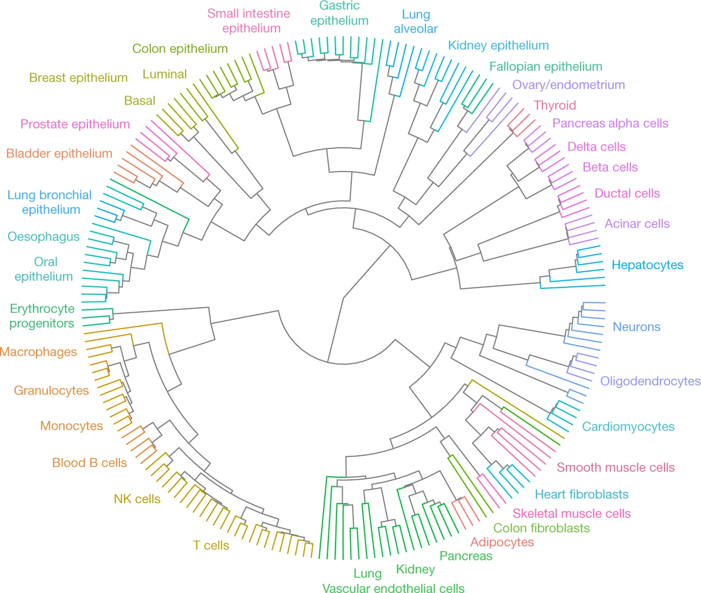

# Read level cell type classification with MethylBERT: a negative result

*Eric Gao. Report on a 2025 internship project.*

## Summary

DNA methylation separates human cell types well when it is measured in aggregate, over thousands of molecules; reference atlases such as Loyfer et al. (2023) can recover the cell type makeup of a tissue or a blood sample from it. This project asked whether the same signal survives in a single sequencing read. We adapted MethylBERT, a transformer that classifies single reads as tumour or normal, into a classifier over the 39 cell types of the Loyfer atlas, and trained 45 models between July and September 2025.

For single reads with hard labels, the answer is mostly no. Our first 39 class model reached 99% accuracy, but the result was a data leak: every marker region in its training set belonged to exactly one cell type, so the region alone gave away the answer. Once we removed that shortcut, accuracy within families of related cell types stayed close to chance (0.20 to 0.55, against chance levels of 0.17 to 0.33), and it did not move across three loss functions, three model depths, and learning rates spanning two orders of magnitude. Pure samples, which a working model should assign almost entirely to one class, came out near uniform. The data suggest why. In raw preprocessing output for the one sample we checked, fewer than 2% of reads fall in a marker region of their own cell type; in one family, a third of the test reads have an identical read in training that carries a different label. A single hard label per read cannot fit data like that.

To make the problem smaller, we split the atlas into lineage families and trained a specialist classifier for each; this helped in some families and not in others. The goal behind that plan, read level classification across all 39 cell types, was then reached by the group that built MethylBERT (Rizdvanetskyi, Roos and Lutsik, 2026) with a different tool: data driven soft labels. Their diagnosis matches ours, and their result completes what this project set out to do.

## Background and question

MethylBERT (Jeong et al., 2025) is a BERT model pretrained on bisulfite sequencing reads. Fine tuned, it assigns each read a probability of coming from a tumour, then pools thousands of those weak calls into an estimate of tumour purity for the whole sample. The design is deliberately modest: the call on any one read is not meant to be strong, and the accuracy comes from the pool.

Read level methods for cell type deconvolution already exist, including UXM (Loyfer et al., 2023), cfDecon (2025), and Alpha (Qi et al., 2025). They estimate the cell type proportions of a pool of reads rather than naming the cell type of each read.

We asked whether the same machinery could go from two classes to 39: whether a single read could be assigned to its cell type of origin across the healthy human body, using the whole genome bisulfite atlas of Loyfer et al. (2023) as the reference. The motivation came from cancer. A classifier of this kind could, in principle, place a read from a circulating tumour cell against a full reference of normal tissue.

## What we built

- **Preprocessing** (`Preprocessing/`). The atlas ships each sample as a `.pat.gz` file of read level methylation patterns. We converted 206 samples into training rows over roughly 49,600 autosomal marker regions (about 1,000 per cell type). Each row holds the read's DNA sequence as 3-mers, a methylation string over those 3-mers, the region ID, the sample's cell type, the cell type the region marks, and a read count.
- **Model** (`Training/src/methylbert/`). We widened MethylBERT's classification head from two outputs to N and labelled each read with its own cell type. To fight the collapse onto the most common class, we added focal loss, decoupled focal loss, class weighting, label smoothing, and class balanced batch sampling. The full list of changes is in [`MODIFICATIONS.md`](Training/src/methylbert/MODIFICATIONS.md).
- **Families.** When the flat 39 class problem did not learn for the right reasons (see Results), we grouped cell types into seven families that roughly follow the clades of the atlas dendrogram (Figure 1), then trained one classifier per family:
  - Blood (6 types), Structural (6), Metabolic (6), Surface (6), Digestive (4), Reproductive (4), Excitable (3).
  - 34 of the 39 types are covered. `Lung-Ep-Alveo` sits in two families, and five types with few samples are in none: bone osteoblasts, dermal fibroblasts, epidermal keratinocytes, gallbladder, and bronchial epithelium.
  - We trained only the second stage, the classifiers within each family. The first stage, which would route a read to its family, was never trained.

*Figure 1. Samples of the Loyfer et al. atlas clustered by genome wide methylation. Reproduced unchanged from Loyfer et al., Nature 613, 355–364 (2023), Figure 2, under a [CC BY 4.0 license](https://creativecommons.org/licenses/by/4.0/). The colour coded clades are the basis for our families. Cells within one clade sit close together because their methylation is similar, which is what makes classification within a family hard.*

## How training and test data were split

This matters for every number below, so we state it plainly.

- **First split.** The early 39 class runs used an 80/20 random split of reads within each cell type (`Training/Toolbox/split_data_simple.py`). Reads from the same sample, and identical reads, fell on both sides.
- **Later splits.** Later runs used `Training/Toolbox/split_data_flexible.py` (75/25), which has six modes.
  - The default mode keeps whole samples on one side only for cell types with four or more samples, and even then may divide one sample between the sides.
  - For cell types with three or fewer samples, it pools all reads and splits them by unique sequence.
  - Other modes remove duplicate reads, then split at random by read. A manual mode assigns whole samples, but we never used it for a reported run.
- **What was recorded.** The runs did not record which mode built each dataset, and the saved rows carry no sample ID.
- **What we can check.** The one family split we can audit directly, Excitable, behaves like a read level split. Every test region appears in training, and 49% of test reads have an identical read in training (`Results/audit_results.txt`).

The consequence is that all reported numbers come from splits in which reads from the same donor can sit on both sides. This kind of leak inflates accuracy; it does not deflate it. The near chance results therefore stand, but the higher numbers, 0.83 for pancreatic acinar versus duct cells and 0.55 for the Excitable family, should be read as upper bounds.

## Results

The full record of all 45 runs, with metrics, curves, confusion matrices, and logs, is in [`Results/`](Results/README.md). Accuracy below is from the checkpoint with the lowest eval loss.

### The first 39 class result was a leak

The first flat 39 class models reached 0.991 and 1.000 accuracy (`res_1M`, `res_pre`). The cause was in preprocessing. The first version of the script collected each sample's reads only over the marker regions of its own cell type, so every region in the training set belonged to exactly one cell type: all 37,918 of them. A rule that looks up the region and ignores the methylation entirely predicts the correct cell type for every test read it covers (99.92% of the test set). The model had learned where a read came from, not what its methylation said. We rebuilt preprocessing to collect every sample's reads over every marker region.

### Without the shortcut, the flat model tracked the region

The rebuilt 39 class dataset was balanced so that half of each sample's reads fell in its own cell type's marker regions and half fell elsewhere. The agreement between a read's cell type and its region's cell type came out at 50.0% for every type (standard deviation 0.46 points; `Data/ctype_dmr_agreement_analysis.txt`). This figure was set by our balancing step; it is not a biological measurement.

On this dataset the model reached 0.520 accuracy and a macro F1 of 0.511 (`res_39Class`), far above the 0.026 chance level. Yet a rule that reads only the region would score about 0.50 on the same data, and the model's recall sits between 0.46 and 0.53 for 36 of the 39 types. The simplest reading is that most of the 0.52 comes from region identity; we cannot tell how much, if any, comes from the methylation pattern itself. Two early six class runs on a different subset (`res_6Class_6Enc`, `W_res_6Class_2Enc`) also landed near 0.52. Their datasets were not saved, so we cannot check them, but the same explanation may apply.

### Within families, accuracy stayed close to chance

In the family datasets the region carries little class information. In the Excitable split, 99.9% of regions contain reads from every class, and a region-only rule scores 0.386 against a chance level of 0.333. The model therefore has to read the methylation pattern, and it mostly could not.

| Family | Classes | Chance | Runs | Accuracy | Macro F1 |
| --- | --- | --- | --- | --- | --- |
| Excitable (cardiomyocyte, neuron, oligodendrocyte) | 3 | 0.333 | 1 | 0.548 | 0.542 |
| Digestive | 4 | 0.250 | 1 | 0.395 | 0.386 |
| Reproductive | 4 | 0.250 | 2 | 0.378 to 0.394 | 0.372 to 0.382 |
| Blood | 5 | 0.200 | 3 | 0.372 to 0.401 | 0.358 to 0.376 |
| Blood | 6 | 0.167 | 19 | 0.198 to 0.430 | 0.189 to 0.348 |
| Surface | 6 | 0.167 | 3 | 0.276 to 0.277 | 0.267 to 0.273 |
| Metabolic | 6 | 0.167 | 3 | 0.244 to 0.273 | 0.239 to 0.270 |
| Structural | 6 | 0.167 | 6 | 0.217 to 0.246 | 0.175 to 0.228 |

The Excitable family, the most lineage distant trio in the atlas, cleared chance by 21 points; Digestive and Reproductive cleared it by about 14; Structural by 5 to 8. On an absolute scale, then, the hierarchy worked in some families and not in others. Measured as a ratio to chance, however, the picture is flatter. The best run in Excitable, Digestive, Reproductive, Surface, and Metabolic sits between 1.5 and 1.7 times chance, Structural reaches about 1.5, and Blood, the most tuned family, reaches about 2 by macro F1. The smaller families look better on an absolute scale mainly because their chance level is higher. The highest Blood accuracy (0.430) came from a run evaluated on an unbalanced test set whose largest class is 33% of reads; its macro F1 (0.346) is in line with the other Blood runs.

### Tuning did not move the ceiling

The Blood family received the most attention: 22 runs over three weeks. Across the whole project we varied the loss (cross entropy, focal, decoupled focal, label smoothing), the depth (2, 4, and 6 encoder layers), the learning rate (5e-6 to 5e-4), the read length cap (250 to 500 tokens), the marker set (250 or 1,000 regions per type), batch balancing, the amount of data, and the split. Six class macro F1 in Blood stayed between 0.19 and 0.35. Several runs showed the signature of memorisation rather than learning. In `NoOverlap_6Enc_250_6`, for example, training accuracy reached 1.0 while eval loss rose from 1.29 to 3.53.

### Pure samples did not resolve

A working read classifier should assign nearly every read from a pure sample to that sample's cell type. Ours did not.
- Three Blood models assigned the plurality of reads to B cells for every sample, including T cells, NK cells, monocytes, and erythrocyte progenitors.
- A fourth Blood model spread reads almost evenly across the six classes and often put T cells on top regardless of the input.
- The Structural model placed the true class first in one of five samples, with the top class at 20% to 30% against a uniform 16.7%.

The saved files do not record whether these samples were held out from training, which would only have made the task easier.

### One pair separated well: pancreatic acinar versus duct

Two binary runs separated pancreatic acinar cells from duct cells with 0.83 accuracy (macro F1 0.82). The pair is closely related, not distant, so this is the clearest sign that single reads carry cell type information in at least some comparisons. The dataset and split for this pair were not saved, so we cannot rule out shared donors or the region shortcut; we treat 0.83 as an upper bound.

## Why the ceiling exists

The temptation is to read these numbers as a tuning failure. The tuning results above argue against that, and the data point to a more basic cause. Three read-only audits of the saved splits (`Results/audit_splits.py`) support it:

- **Most reads carry no marker signal.** In raw preprocessing output for one skeletal muscle sample, only 1.7% of reads fall in a marker region of their own cell type. The rest come from regions where, by construction, cell types look alike. Rizdvanetskyi et al. (2026) report the same order of magnitude, about 1 in C reads (roughly 3% for 39 types).
- **Identical reads carry different labels.** In the Excitable split, 35.4% of test reads have an identical training read, same sequence and same methylation pattern, labelled with a different cell type. For such a read, no classifier can be right about every copy; a hard label forces it to pick one and pay for the rest.
- **Location does not help within a family.** Nearly every region holds reads from every class, so the model must separate classes by pattern alone, and the patterns are largely shared.

Taken together, these are consistent with a mapping from methylation pattern to cell type that is many to many rather than many to one. Under that mapping, a model trained to output one cell type per read has a low ceiling regardless of its capacity. Two gaps keep us from stating this more strongly. We never ran a simple baseline, such as logistic regression on each read's CpG pattern, so we cannot show that a far simpler model hits the same ceiling. We also never held out whole samples, so the ceiling we measured is, if anything, too high.

## Limitations

- **Read level splits.** Reads from the same donor can appear in training and test (see above), and one sample was sometimes divided between them.
- **No simple baseline.** Without logistic regression or a similar model on the CpG pattern, we cannot claim MethylBERT extracts all the signal a read holds.
- **Test class frequencies used in training.** The classifier's bias was initialised from the class frequencies of the test file. Only class proportions leak, not read content.
- **Confidence values are unreliable.** Probabilities pass through softmax twice, which compresses reported confidence toward uniform. Accuracy and predicted classes are unaffected.
- **Incomplete records.** Twelve runs kept a stale template in place of their real parameters, and dataset building choices (split mode, balancing) were not logged per run.
- **Marker list provenance.** The marker region lists derive from the Loyfer atlas, but the exact source table was not recorded.
- **Half a hierarchy.** The families cover 34 of 39 types, and the routing stage was never trained.

## The direction we chose, and how the original lab completed it

From mid August 2025 our working plan was the hierarchy: split the atlas along its dendrogram, train specialist classifiers where the differences are finest, and route each read to its family with a first stage. The aim was to reach whole body classification by making each individual problem smaller. The family results above were the first half of that plan. They showed partial success, and they also showed that shrinking the class set does not remove the conflict between identical reads with different labels.

In July 2026, the group that built MethylBERT published Syto (Rizdvanetskyi, Roos and Lutsik, 2026), which scales read level classification to all 39 cell types of the same atlas. Their diagnosis matches ours: at this scale, non-discriminative reads dominate, and hard labels conflict with the many to many mapping between methylation patterns and cell types. Their remedy is different. They keep all 39 types in one flat problem and replace each hard label with a data driven soft label, an estimate of the distribution of cell types given the read. Three further differences from our setup are worth naming:
- They evaluate deconvolution error on mixtures rather than per read accuracy.
- They split data by biological source where possible.
- They use MethylBERT as one of several classifiers inside their framework.
They report a 2.56 fold lower mean squared error than the previous state of the art.

We take two things from this. First, the question was real: the lab that built the model reached the same obstacle we did, from the same starting point. Second, the obstacle sits in the target more than in the class structure. A hierarchy reduces how many classes compete, but it keeps the hard label, so it could not address the conflict our audits measured; soft labels address it directly. In that sense, Syto completed the project we had started. It reached whole body read level classification by changing the one constraint our design left in place.

## Conclusion

This project set out to classify single methylation reads across the whole human body, and on its own it did not get there. What it did establish is where, and why, a single read with a hard label falls short. The early 99% was a region leak rather than a signal. With the leak removed, the flat model tracked region identity, the family models stayed close to chance in most families, and no amount of tuning changed either result. The audits of the saved data account for this ceiling: most reads carry no marker signal, and identical reads carry different labels, so a target that demands one cell type per read asks for information that a single read does not hold.

The goal itself was sound, and it has since been reached. Read together, our results and those of the Lutsik group give one consistent account. At whole body scale, a single read supports a distribution over cell types rather than a single answer; a classifier trained to report that distribution, pooled over many reads, can resolve the full atlas, while one trained to choose a single cell type per read cannot.

## References

- Jeong, Y. et al. (2025). MethylBERT enables read-level DNA methylation pattern identification and tumour deconvolution using a Transformer-based model. *Nature Communications* 16, 788.
- Loyfer, N. et al. (2023). A DNA methylation atlas of normal human cell types. *Nature* 613, 355–364. Source of the UXM fragment level deconvolution method and of Figure 1.
- Rizdvanetskyi, D., Roos, N. and Lutsik, P. (2026). Data-driven soft labeling scales DNA read classification to whole-body cell-type deconvolution. arXiv:2607.04987.
- Qi, T. et al. (2025). Read-level DNA methylation deconvolution enhances circulating tumor DNA detection. *Briefings in Bioinformatics* 26(5), bbaf551.
- cfDecon: accurate and interpretable methylation-based cell type deconvolution for cell-free DNA (2025). bioRxiv, doi:10.1101/2025.02.11.637663.
