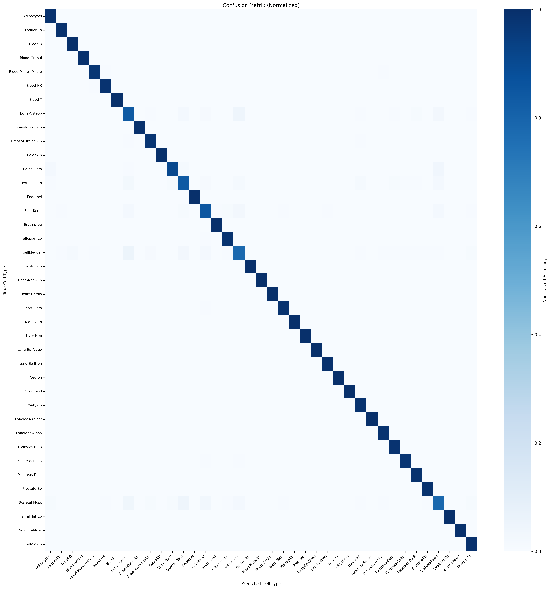
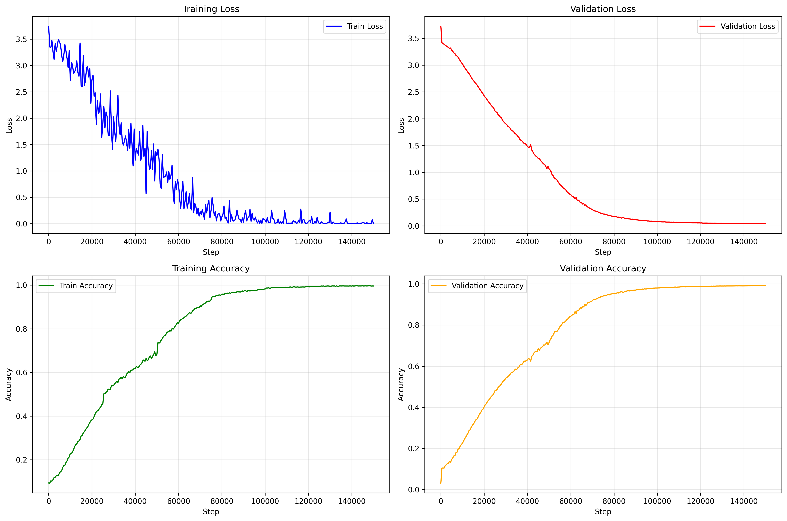

# MethylBERT for Read-Level Cell-Type Classification: A Study and Its Limits

*Eric Gao. Retrospective report on an internship project (2025).*

## Summary

DNA methylation is one of the most reliable molecular fingerprints we have for telling one human cell type from another, and reference-based methods that read it in aggregate now recover the cellular makeup of a tissue or a blood sample with real accuracy. This project asked a narrower and harder question: does that same signal survive at the level of a single sequencing read? The appeal is obvious, since a read-level classifier would keep the resolution that aggregate methods average away, and it could in principle name the origin of one molecule rather than a whole pool. However, a single read is a thin slice of evidence, a few CpG sites strung along a short fragment, and the central result of this work is a precise account of where that thinness becomes fatal. I could separate cell types that sit far apart on the developmental tree, yet within families of related cells the classifier fell toward chance, and I can show, from the data itself, that the fault lies less in the model than in how little a lone read has to say.

A read, in the end, is like a single word overheard across a crowded room. Sometimes one word betrays the speaker; far more often the word belongs to everyone, and only the whole sentence gives them away.

## The question

The starting point was MethylBERT (Jeong et al., *Nature Communications*, 2025, from Pavlo Lutsik's group at DKFZ and KU Leuven), a transformer that reads read level methylation and does two things: it classifies each read as tumour or normal, then aggregates thousands of those weak binary calls into an accurate estimate of tumour purity for the whole sample. The design is deliberate about its own modesty; the per read call is not meant to be strong, and the payoff lives in the aggregate.

My goal was to push that binary machine into a general one: instead of tumour versus normal, could a single read be assigned to its cell type of origin across the healthy human body? If it could, the same tool that estimates tumour purity might one day place a circulating tumour cell against a full reference of normal tissue, which was the cancer facing motivation behind the project.

## What I built

I forked MethylBERT and rebuilt its objective. The classification head was widened from two outputs to N, one per cell type; each read was relabelled with its own cell type rather than with a match or not flag; and I wrote a preprocessing pipeline that turns raw `.pat` methylation fragments into training rows over the differentially methylated regions (DMRs) of the reference atlas. The atlas is the 39-cell-type whole-genome bisulfite map of Loyfer et al. (*Nature*, 2023), the same reference the deconvolution field has standardized on.

Fine grained classes tend to collapse onto whichever class is most common, so I spent much of the effort fighting that collapse: focal and decoupled-focal losses, class weighting, label smoothing, and class-balanced batch sampling. When the flat 39 way problem refused to learn, I grouped the atlas into functional families, Blood, Metabolic, Structural, Reproductive, Digestive, Excitable, and epithelial Surface types, and trained a specialist model within each. The reproducible pieces live under `Pretraining/` and `Training/`.

## Results

The pattern is consistent, and it is worth stating plainly rather than dressing up. The model learns well when the cell types are lineage-distant, and it decays toward chance as the types converge.

| Task                                                    | Classes | Chance | Read-level accuracy      | Macro F1  |
| ------------------------------------------------------- | ------- | ------ | ------------------------ | --------- |
| Pancreas Acinar vs. Duct                                | 2       | 0.500  | **0.833**                | 0.825     |
| Excitable (cardiomyocyte, neuron, oligodendrocyte)      | 3       | 0.333  | 0.548                    | 0.542     |
| Digestive epithelia                                     | 4       | 0.250  | 0.395                    | 0.386     |
| Reproductive epithelia                                  | 4       | 0.250  | 0.394                    | 0.382     |
| Blood                                                   | 6       | 0.167  | 0.30–0.38                | 0.28–0.35 |
| Surface (epithelial)                                    | 6       | 0.167  | 0.277                    | 0.267     |
| Metabolic (liver + pancreas subtypes)                   | 6       | 0.167  | 0.24–0.27                | 0.24–0.27 |
| Structural (fibroblast, muscle, adipocyte, endothelium) | 6       | 0.167  | 0.238                    | 0.228     |
| Full atlas (flat)                                       | 39      | 0.026  | collapses to near chance | —         |

Two binary discriminations between distant types reach the low eighties; the maximally distinct trio of a heart muscle cell, a neuron, and an oligodendrocyte reaches the mid-fifties, then begins to overfit. Yet every task that asks the model to separate cousins, one pancreatic endocrine subtype from another, one fibroblast from another, sits within a few points of a coin flip. A representative Structural-family run, with its confusion matrix and training curves, is saved under `Training/Run_Result/bert.model/plots/` and reproduced below.

*Row-normalised confusion matrix for the Structural family (Adipocytes, Colon-Fibro, Endothel, Heart-Fibro, Skeletal-Musc, Smooth-Musc). The weight sits off the diagonal: reads of most types are pulled into a few attractor columns rather than onto their own class. This is what near-chance accuracy looks like up close, not random scatter but a systematic inability to hold the classes apart.*

*Training dynamics for the same model. Validation accuracy climbs off the six-class chance line of 0.167 to a plateau near 0.24 by roughly thirty thousand steps, while validation loss bottoms out around twenty thousand steps and then turns back upward. The model extracts the little separable signal the reads carry, then begins to overfit rather than improve.*

The clearest verdict comes from deconvolution rather than accuracy. Given a pure sample of a single known cell type, a working system should assign nearly all of its reads to that one class. Mine did not; pure samples dissolved into a near-uniform spread across the family, with average confidence barely above the uniform floor, or else collapsed onto one class regardless of the input. The aggregate, which is supposed to be the strong part, was not strong.

## Why the ceiling exists

The temptation is to read these numbers as a tuning failure and to keep turning knobs. I ran that experiment thoroughly, across encoder depths, learning rates, sequence lengths, and four different loss functions, and the ceiling did not move. The reason sits in the data, and I measured it directly.

For every read I compared its true cell type against the cell type its DMR region is supposed to mark. Across 2.37 million reads and all 39 types, the two agree about 50 percent of the time, and, tellingly, the agreement is 50 percent for *every* cell type, with a standard deviation of less than half a percentage point (`Data/ctype_dmr_agreement_analysis.txt`). A region-level analysis of the training set tells the same story: within a single DMR, reads from every class arrive in roughly equal numbers (`Training/Toolbox/dmr_label_analysis_train.txt`).

In other words, DMRs are differentially methylated on average, over a pool of molecules, but the individual reads inside them are not cell-type-specific one at a time. This is the shared vocabulary problem made quantitative. The map between a read's methylation pattern and its cell of origin is many to many, not many-to-one, so no amount of model capacity can recover a label that the read does not carry. Binary tumour-versus-normal survives because the two vocabularies are far enough apart; a 39 way distinction among related human cells does not.

## Where the field has gone

Fairness demands that I place this against the current work rather than in isolation. The reference based method UXM (Loyfer, 2023) already deconvolves the atlas at fragment level without deep learning. cfDecon (2025) and read-level circulating-tumour-DNA deconvolution (Chen et al., *Briefings in Bioinformatics*, 2025) attack the same signal with newer architectures. Most directly, a July 2026 preprint from Pavlo Lutsik's group, the same group that authored MethylBERT, scales read- level classification to exactly this whole body, 39 type setting. They reach the same diagnosis I did, that the read-to-cell-type map is many-to-many, and they resolve it with data driven ***soft*** labels, replacing my hard one hot target with the empirical distribution of cell types over reads that share a pattern, and weighting each read by how informative it is.

I take two things from this. The instinct was sound: the originating lab converged on the same problem and the same underlying obstacle, which tells me the question was real and worth asking. The method was wrong: hard labels are the wrong tool for a many to many signal, and that choice, more than any hyperparameter, is why my classifier stalled where theirs advanced.

## What I take from this

This project did not produce a working whole body cell type classifier, nor did it show the idea to be impossible. What it did was map the boundary between what one read can and cannot say, and it named the reason with a measurement rather than a guess. The successes mark one edge of that boundary, where lineages are distant enough that a single read still discriminates; the failures mark the other, where cousins share too much of their methylation vocabulary for any lone molecule to tell them apart.

The lesson is the one the metaphor kept insisting on. A read is a single word, and most words are common property; it is the sentence, the pooled and weighted chorus of many reads, that finally names the speaker.

## Repository layout

- `Pretraining/`: converts `.pat` methylation fragments and the atlas DMRs into training rows (`DNA_seq`, `Methyl_seq`, `DMR_Label`, `cType`, `Read_Count`).
- `Training/`: the fine-tuning code (`Training/src/run_training.py`), configs for each loss and family (`Training/Config/`), and analysis tools (`Training/Toolbox/`).
- `Training/Run_Result/bert.model/plots/`: metrics, confusion matrices, and training curves for a representative run.
- `Data/ctype_dmr_agreement_analysis.txt`: the read-versus-DMR label agreement measurement that anchors the central finding.

### References

- Jeong et al. (2025). *MethylBERT enables read-level DNA methylation pattern identification and tumour deconvolution using a Transformer-based model.* Nature Communications 16:788.
- Loyfer et al. (2023). *A DNA methylation atlas of normal human cell types.* Nature 613:355–364.
- Rizdvanetskyi, Roos, Lutsik (2026). *Data-Driven Soft Labeling Scales DNA Read Classification to Whole-Body Cell-Type Deconvolution.* arXiv:2607.04987.

